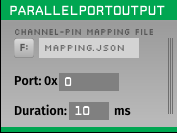

# Parallel port output plugin
A plugin that sends TTL events for a given channel over a parallel port. 
<p align="center">
  
</p>
<p align="center"><i>Parallel port output plugin</i></p>

### Parameters

**In:** The input TTL channel which triggers events. The parallel port will be set to high when an incoming "on" TTL event comes in on this channel.

**Port:** The address of the LPT port. This can be found through device manager and clicking on "properties", "resources", and looking at the I/O range.

**Duration (ms):** This is how long the port will be set to high after a trigger event comes in.

> **_However, please note:_**
> 
> **_The parallel port does not precisely match the "duration" length; instead, it starts at the targeted event. The variation in the duration of the state being on or off depends on the Open Ephys (OE) configuration._**

## Building the plugins
Building the plugins requires [CMake](https://cmake.org/). Detailed instructions on how to build open ephys plugins with CMake can be found in [our wiki](https://open-ephys.atlassian.net/wiki/spaces/OEW/pages/1259110401/Plugin+CMake+Builds).

## Installation

If you are building this plugin outside the `oep-installation` installation, follow these steps:

1. **Navigate to the `parallel-port-output` folder**  
   This folder should be located next to the `Source` and `Build` folders.

2. **Open Git Bash**  
   Launch Git Bash or your preferred terminal.

3. **Create a `.gitignore` file**  
   Run the following command to create a `.gitignore` file:
   ```bash
   touch .gitignore
	```
	
4. **Navigate to the `Build` directory**
   ```bash
   cd Build
   ```
   Run the following command to create a `.gitignore` file:
   ```bash
   touch .gitignore
   ```
6. **Generate the project for your version**
	Run the following command to generate the Visual Studio project:
  
  ```bash
	cmake -G "Visual Studio 17 2022" -A x64 ..
  ```
7. **Build the project in Release mode**
	Run the following command to compile and build the Release version of the plugin:
  
  ```bash
	cmake --build . --config Release
  ```
8. **Install the plugin (copy DLLs to the correct folder)**
	To install the plugin and copy the generated DLLs to the appropriate folder, run:
  
  ```bash
	cmake --install . --config Release
  ```
9. ***Install the parallel port library**
    Currently, only 64-bit Windows systems are supported, utilizing the inpoutx64.dll provided in the libs folder. The installation process (cmake) should copy the dlls to the shared folder within the plugin-GUI, if it doesn't, please copy those in.

## Parallel Port additional information
### Drivers and parallel port connected
* Obtain the appropriate drivers from the manufacturer's website.
* Install the drivers correctly.
* After installation, open Device Manager.
* If the "Ports (COM & LPT)" is not visible, go to View and select Show hidden devices.
* Verify that the parallel port appears under "Ports (COM & LPT)".
* The parallel port will be listed as LPT.

## Developer's Note:
Original Developer: Joel Nielsen
Modified/Updated by: Sumedh Sopan Nagrale (nagra007@umn.edu)
Currently Maintained by: Sumedh Sopan Nagrale (nagra007@umn.edu)
